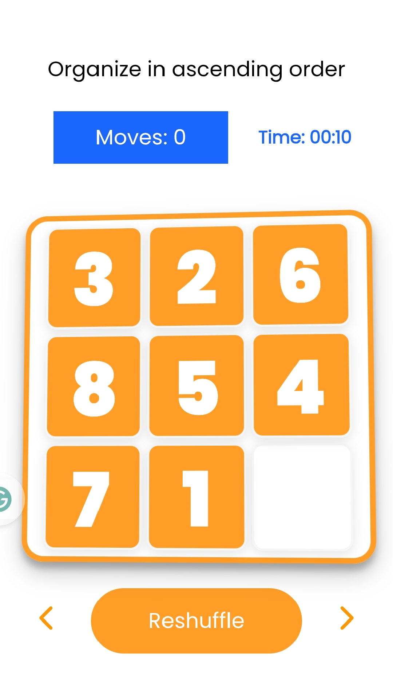

# Sliding Puzzle Game - README

 <!-- Add a screenshot if available -->

## Table of Contents
- [Overview](#overview)
- [Features](#features)
- [How to Play](#how-to-play)
- [Installation](#installation)
- [Game Logic](#game-logic)
- [Technologies Used](#technologies-used)
- [Project Structure](#project-structure)
- [License](#license)

## Overview
A classic sliding puzzle game where players rearrange scrambled image tiles to form a complete picture. The game features multiple image sets, move counting, and timer functionality.

## Features
- 🖼️ Multiple image sets (9 different puzzles)
- ⏱️ Game timer with minutes:seconds display
- 🔢 Move counter tracking player efficiency
- 🔀 Automatic generation of solvable puzzles
- ↔️ Navigation between different puzzles
- 🔄 Puzzle reshuffling option
- 📱 Touch device support
- 🏆 Victory screen showing completion stats

## How to Play
1. Click "Start Game" to begin
2. Click on any tile adjacent to the empty space to move it
3. Rearrange tiles to complete the image
4. Game tracks:
   - Number of moves
   - Completion time
5. Use navigation buttons to switch between different puzzles
6. Click "Reshuffle" to restart the current puzzle

## Installation
1. Clone the repository:
```bash
git clone https://github.com/your-username/sliding-puzzle.git
```
2. Ensure you have all image assets in `/images1` through `/images9` folders
3. Open `index.html` in your browser

## Game Logic
### Puzzle Solvability
The game uses an inversion count algorithm to ensure all generated puzzles are solvable:
```javascript
const getInversionCount = (arr) => {
  // Counts tile pairs that are in reverse order
};

const isSolvable = (arr) => {
  // Returns true if inversion count is even
};
```

### Movement Validation
The game checks if a move is valid by verifying adjacency:
```javascript
const checkAdjacent = (row1, row2, col1, col2) => {
  // Returns true if tiles are vertically/horizontally adjacent
};
```

### Timer System
```javascript
const startTimer = () => {
  // Starts counting seconds and minutes
};

const updateTimer = () => {
  // Updates display every second
};
```

## Technologies Used
- HTML5
- CSS3
- JavaScript (ES6)
- Font Awesome for icons

## License
Distributed under the MIT License. See `LICENSE` for more information.